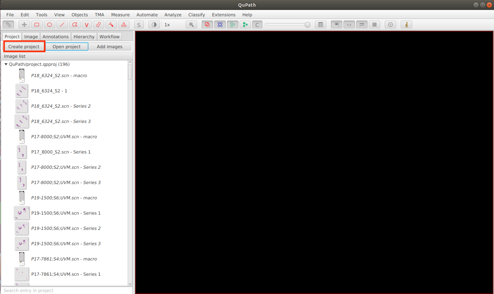
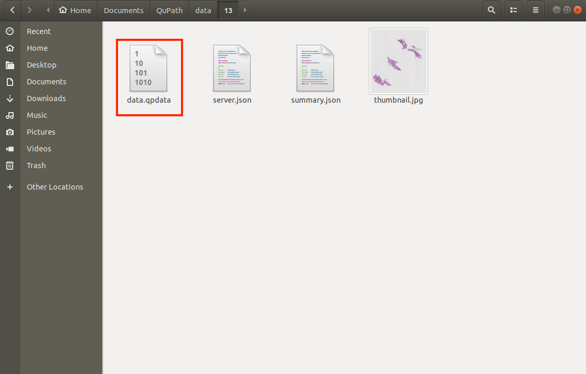
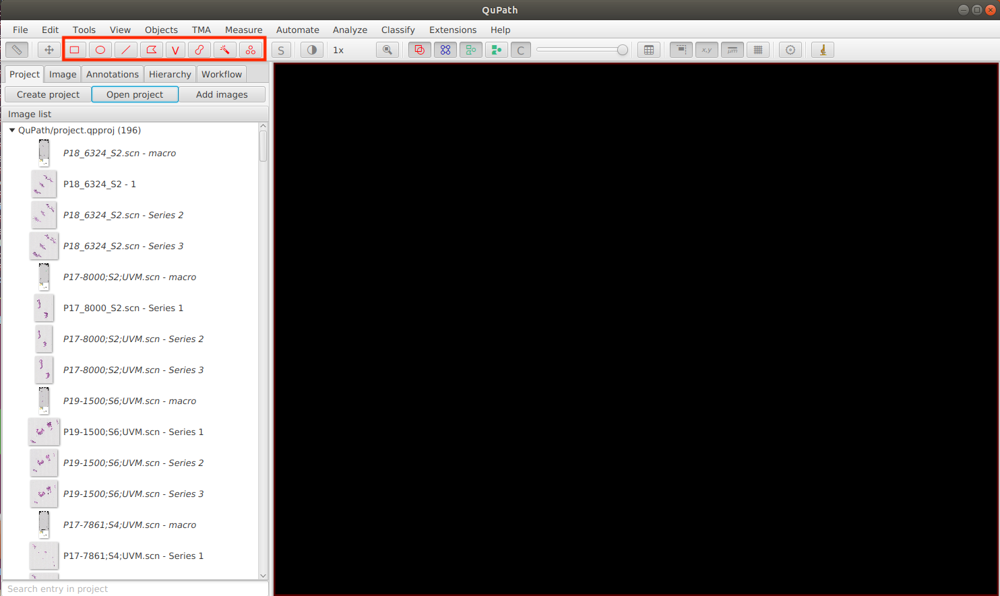
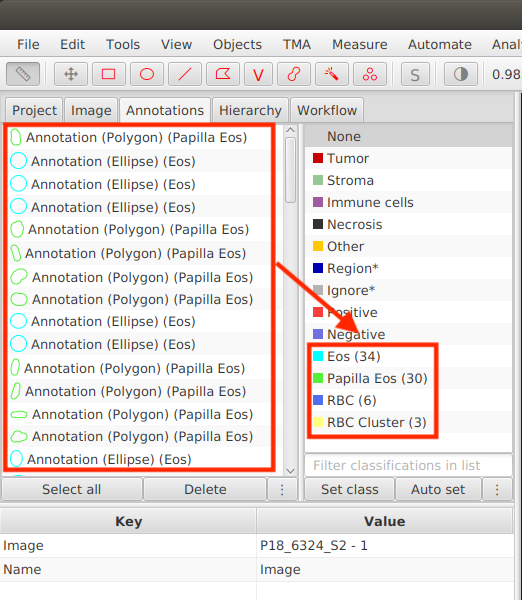
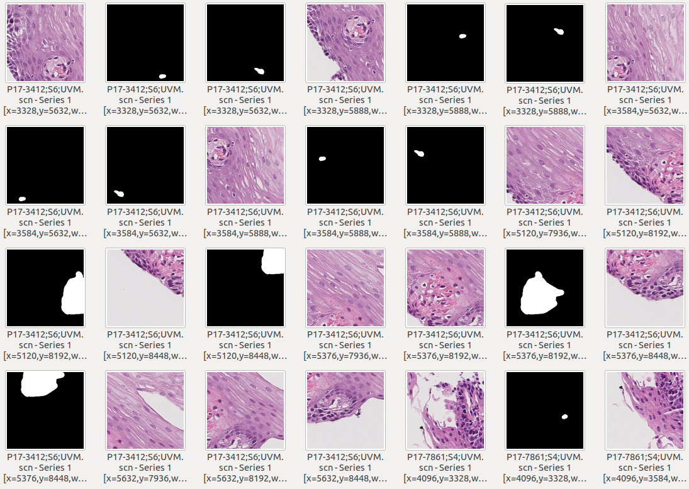

## Data Preparation Pipeline Steps
### Step 1: Image Annotations

  1. #### Software Installation

     To begin annotating the Whole Slide Image, you will need to download the **QuPath** software. You can download it by following the provided [link](https://qupath.readthedocs.io/en/0.4/docs/intro/installation.html). Once the software is installed, you can start the annotation process by clicking on the "Create Project" button. From there, you can open the desired Whole Slide Image that you want to annotate.

     

     
  2. #### How to Open Pre-existing Annotations?

     If we have pre-existing annotation file (in .qpdata format) and we want to import the annotation file to our whole slide image, we can first click **File/save** button and then go to the project directory. In the project directory where your QuPath project is located, you can see an empty annotation file (in .qpdata format). We can replace the empty annotation file by the pre-existing file and reopen the Whole Slide Image. Then the annotations will be correctly imported into our project.

     

  2. #### How to Annotate?

     To annotate, we can use the toolbar on the top bar. There are eight different shape of brush stroke we can use depending on the shape of the objects we want to annotate. Then we can click the shape we want and draw the annotated objects in the Whole Slide Image.

     

  5. #### How to View Your Annotations and How to Classify Them?

     To access your annotations, navigate to the Annotations button located on the top bar. By clicking on an annotation, you can view the corresponding region and make edits if necessary. To assign a classification to your annotation, select the desired annotations and choose the desired class. Finally, click the **Set class** button to apply the assigned class.

     
     
  6. #### Convert Annotations into JSON File

     Run the [link](../src/export_json.groovy) inside QuPath (Automate bar → Show script editor → paste script → run). Make sure to change the **path** to your directory.

     You can also refer to QuPath document for additional help using this [link](https://qupath.readthedocs.io/en/0.4/docs/advanced/exporting_annotations.html#shapes).

### Step 2: Image Segmentation

  1. #### Generate Segmentation

     Run the [export_patches script](../src/export_patches.groovy) inside QuPath (Automate bar → Show script editor → paste script → run). Please ensure to modify the **path** in the code to match your directory. Additionally, you have the flexibility to adjust parameters like downsample, tileSize, and pixel overlap according to your specific design requirements. In our implementation, the patch size is set as 512x512 pixels, which means the original Whole Slide Imaging (WSI) will be segmented into patches of that size.

     You can also refer to QuPath document for additional help using this [link](https://qupath.readthedocs.io/en/0.4/docs/advanced/exporting_annotations.html#binary-labeled-images).

  2. #### Generate Contour

     Run the python [json_to_contour script](../src/json_to_contour.py) to generate contour corresponding to the 512x512 pixels patches (see following figure). As depicted in the figure, the generated contour will be segmented into patches of 512x512 pixels. Each individual annotation will be painted in its respective location within the patch.

     If there are multiple annotations within a patch, all of the contours will be generated and placed after the original patch.

     

### Step 3: Dataset

  1. #### Dataset Splitting

     The EoE dataset consists of more than 12,000 annotations spread across 50 annotated Whole Slide Images (WSIs). In order to assess the performance of models accurately, the dataset was divided into three subsets: train, val (validation), and test. The split ratio used for this division was 7:1:2, respectively. You have the flexibility to adjust the dataset splitting ratio according to your specific design requirements. Feel free to set the splitting ratio that best suits your needs.

  2. #### Generate COCO File

     To convert the contour patches we have created into a COCO file, you can run the provided Python script. Please use the following link to access the [class_to_coco script](../src/class_to_coco.py). To set the train, val, and test dataset ratios that you have specified, you can update the "sublist" array as shown below:

     ```python
     sublist["train"] = ["WSI_1", "WSI_2", ...]
     sublist["val"] = ["WSI_3", "WSI_4", ...]
     sublist["test"] = ["WSI_5", "WSI_6", ...]
     ```

     Upon running the script, the contour patches will be read and transformed into the COCO file format. Here is an example of how a COCO format file looks:

     ```json
     {
        "info": {
          "description": "Example COCO file",
          "version": "1.0",
          "year": 2023,
          "contributor": "Your Name",
          "date_created": "2023-06-14"
        },
        "images": [
          {
            "id": 1,
            "file_name": "image1.jpg",
            "width": 512,
            "height": 512
          },
          {
            "id": 2,
            "file_name": "image2.jpg",
            "width": 512,
            "height": 512
          }
        ],
        "annotations": [
          {
            "id": 1,
            "image_id": 1,
            "category_id": 1,
            "segmentation": [["x1", "y1", "x2", "y2", "x3"]],
            "area": 100,
            "bbox": ["x1", "y1", "width", "height"]
          },
          {
            "id": 2,
            "image_id": 2,
            "category_id": 2,
            "segmentation": [["x1", "y1", "x2", "y2", "x3", "y3"]],
            "area": 200,
            "bbox": ["x1", "y1", "width", "height"]
          }
        ],
        "categories": [
          {
            "id": 1,
            "name": "Class 1",
            "supercategory": "Class"
          },
          {
            "id": 2,
            "name": "Class 2",
            "supercategory": "Class"
          }
        ]
      }
      ```

  
### Step 4: Model Training and Testing

We utilized two models in our project, namely the CircleSnake model and the Mask R-CNN model. For detailed instructions on how to install these models, you can refer to the following links:

  - [CircleSnake Installation Guide](https://github.com/hrlblab/CircleSnake/blob/main/docs/INSTALL.md)

  - [Mask R-CNN Installation Guide](https://detectron2.readthedocs.io/en/latest/tutorials/install.html)
    
Once you have completed the installation, you can proceed with the training and testing processes by following the specific instructions provided for each model:

  - [CircleSnake Training and Testing](https://github.com/hrlblab/CircleSnake/blob/main/docs/PROJECT_STRUCTURE.md)
     
  - [Mask R-CNN Training and Testing](https://detectron2.readthedocs.io/en/latest/tutorials/getting_started.html)

  1. #### Configure Your Model

     For CircleSnake model, to customize the configuration file based on your design, follow these steps:

     - **Locate the configuration file**: The config file is located inside the "CircleSnake/configs" folder. An example of configuration file is as follows.
       
     - **Understand the structure**: Take some time to familiarize yourself with the structure of the configuration file.

     - **Modify the parameters**: Within the configuration file, you'll find different sections and parameters that can be customized. Modify the values of the parameters according to your design requirements.
     
     - **Test the changes**: Launch the CircleSnake application using the modified configuration file to test your changes. Observe the behavior of the game and verify that the customized parameters have taken effect as intended.
     
     - **Fine-tune the parameters**: If needed, repeat the process of modifying the configuration file, testing the changes, fine-tune the parameters according to your design.
    
     ```yaml
      model: 'coco'
      network: 'ro_34'     # Syntax: arch_numOfLayers
      task: 'circle_snake' # Determines which network to call
      resume: false
      gpus: (0,) # Must be a tuple
      
      train:
          optim: 'adam'
          lr: 2.5e-4
          milestones: (60, 80, 100, 150)
          gamma: 0.5
          batch_size: 1
          dataset: 'eoeTrain' # Change this to your dataset
          num_workers: 1
          epoch: 200
          weight_decay: 0.0
      test:
          dataset: 'eoeTest' # Change this to your dataset
          batch_size: 1
      
      heads: {'ct_hm': 4, 'radius': 1, 'reg': 2}
      segm_or_bbox: 'segm'
      ct_score: 0.05
      save_ep: 5
      eval_ep: 5
     ```

2. #### Register Your Dataset

   To register your dataset in the CircleSnake application, you should add the dataset directory and name to the "/CircleSnake/lib/datasets/dataset\_catalog.py" file. Here's an example of how it can be done:

   ```python
    dataset_attrs = {
        "eoeTrain": {
            "id": "coco",
            "data_root": YOUR_TRAIN_ROOT,
            "ann_file": YOUR_TRAINING_COCO_FILE,
            "split": "train",
        },
        "eoeVal": {
            "id": "coco",
            "data_root": YOUR_VAL_ROOT,
            "ann_file": YOUR_VALITION_COCO_FILE,
            "split": "test",
        },
        "eoeTest": {
            "id": "coco_test",
            "data_root": YOUR_TEST_ROOT,
            "ann_file": YOUR_TESTING_COCO_FILE,
            "split": "test",
        }
    }
   ```

3. #### Configure Training and Testing Settings

   To train the CircleSnake model, you can create a Run/Debug configuration with the following settings:

   ```python
    Script path: 
    /CircleSnake/run.py
    
    Parameters:
    --cfg_file configs/coco_circlesnake_eoe.yaml
    model "LOAD MODEL FROM /model DIR"
    train.dataset eosTrain
    test.dataset eosTest
    pretrain ctdet_coco_dla_2x_converted
    debug_train False
    train.batch_size 16
   ```

   To test the CircleSnake model, you can create a Run/Debug configuration with the following settings:

   ```python
    Script path: 
    /CircleSnake/run.py
    
    Parameters:
    --type evaluate
    --cfg_file configs/coco_circlesnake_eoe.yaml
    model "LOAD MODEL FROM /model DIR"
    test.dataset eosTest
    test.epoch "THE EPOCH YOU WANT TO TEST"
    ct_score 0.2
    segm_or_bbox segm
    dice True
    debug_test True
    save_images True
    rotate_reproduce False
   ```

These guides will provide you with the necessary steps and instructions to train and test your models effectively.
